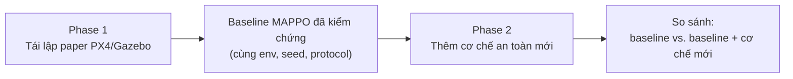
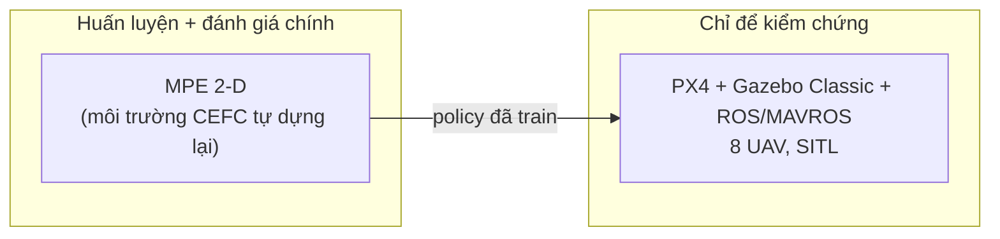
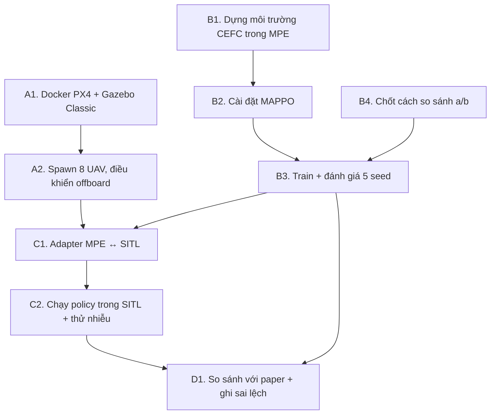

# Safe-MARL-UAV

**Học tăng cường đa tác tử an toàn (Safe Multi-Agent Reinforcement Learning) cho bầy UAV.**

Đây là repo bài tập lớn môn TKPTTT. README này để cả nhóm cùng đọc: bài toán là gì, track PX4/Gazebo cần làm những việc gì, và code nằm ở đâu.

> **Trạng thái hiện tại (2026-09-24):** mới xong giai đoạn *chọn và phân tích paper*. Code mới có phần đo metric ([evaluate/metrics.py](evaluate/metrics.py)) và ghi lại thông tin mỗi lần chạy ([utils/seed.py](utils/seed.py)). Chưa có môi trường, thuật toán hay kết quả huấn luyện nào.

---

## 1. Bài toán

Mỗi UAV là một tác tử (agent). Agent chỉ thấy được một phần môi trường, gồm cảm biến của nó và các UAV lân cận, nên bài toán được mô hình hoá thành **Dec-POMDP**. Cả bầy phải hoàn thành nhiệm vụ chung và **không vi phạm ràng buộc an toàn**, như không va chạm nhau và không va vào vật cản. An toàn được đo bằng một metric riêng, không chỉ là một khoản phạt trong reward.

Dự án chia hai giai đoạn:



- **Phase 1: Tái lập.** Tái lập một paper multi-UAV MARL *đã công bố* chạy trên PX4/Gazebo. Phase này **không** phải đóng góp mới, mục đích là có một baseline đáng tin.
- **Phase 2: Mở rộng.** Chỉ bắt đầu khi Phase 1 đã xong. Ở phase này ta gắn thêm cơ chế an toàn lên baseline (safety shield, lớp MPC, constraint repair, ...) và so sánh trong cùng điều kiện.

**Track chính của nhóm là PX4/Gazebo.** Track AirSim chỉ để tham khảo (xem [mục 6](#6-backlog-tham-khảo-track-airsim)).

---

## 2. Paper tái lập

> Xiang, Li, Li, Zhao, Zhang. *Decentralized Consensus Inference-Based Hierarchical Reinforcement Learning for Multiconstrained UAV Pursuit-Evasion Game.* **IEEE TNNLS** 36(10):18229–18243, 2025.
> DOI [10.1109/TNNLS.2025.3582909](https://doi.org/10.1109/TNNLS.2025.3582909) · arXiv [2506.18126](https://arxiv.org/abs/2506.18126) · PDF có sẵn trong [papers/](papers/)

**Mọi thông số chi tiết nằm trong [papers/px4_gazebo/PAPER.md](papers/px4_gazebo/PAPER.md). Ai code phần nào thì đọc phần đó trong file này trước khi bắt đầu.**

### Nhiệm vụ: CEFC (Cooperative Evasion and Formation Coverage)

8 UAV bay trên mặt phẳng 2-D ở độ cao cố định. Chúng giao tiếp với nhau trong phạm vi giới hạn và phải làm **đồng thời** bốn việc:

1. **Bao phủ mục tiêu:** bay tới 2 vùng mục tiêu (bán kính 3 m, lấy ngẫu nhiên từ 4 góc `(±8, ±8)`) để giảm dần "độ khẩn cấp" κ của từng vùng.
2. **Giữ đội hình:** giữ một trong các đội hình định sẵn `C = {3,4,5,6,7,8}` (số UAV mỗi nhóm), và được phép tách thành nhiều nhóm.
3. **Tránh va chạm:** không va vào vật cản và UAV khác. Khoảng cách an toàn tối thiểu là 0.2 m, ngưỡng cảnh báo là 0.5 m.
4. **Né kẻ truy đuổi:** một adversary do PPO điều khiển sẽ đuổi theo nhóm gần nhất có từ 3 UAV trở lên.

### Điều quan trọng nhất cần hiểu



- **Không huấn luyện trong Gazebo.** Paper huấn luyện trong **MPE** (Multi-Agent Particle Environment, simulator 2-D nhẹ). PX4/Gazebo SITL chỉ dùng để *chạy thử* policy đã train, với động lực học quadrotor thật.
- **Paper không công khai code**, cả code thuật toán lẫn môi trường CEFC. Nhóm phải **dựng lại toàn bộ** dựa trên mô tả trong paper.
- **Paper không có số liệu MAPPO chạy riêng.** Dòng "MAPPO" trong Table IV thực chất là **MAPPO + AT-M**, trong đó AT-M là policy tầng thấp do tác giả đề xuất. Vì vậy, MAPPO thuần của nhóm **không so trực tiếp** được với con số −397.29 của paper (xem [mục 3, bước B4](#b4-chốt-cách-so-sánh-với-paper)).
- **Paper không báo cáo seed hay error bar.** Kết quả của nhóm là mean ± std trên 5 seed `[0,1,2,3,4]` và luôn ghi rõ như vậy khi đặt cạnh số của paper.

### Tóm tắt kỹ thuật

| Thành phần | Nội dung |
|---|---|
| Số UAV | 8 (test mở rộng: 9, 10, 12, 15) |
| Quan sát (mỗi UAV) | UAV lân cận trong bán kính 3 m, thông tin vùng mục tiêu và adversary, LiDAR (M tia), message 64-dim |
| Hành động tầng thấp | Gia tốc 2-D liên tục `[u_x, u_y]`. Vận tốc UAV nằm trong [−1, 1] m/s |
| Hành động tầng cao | Rời rạc 9 lựa chọn: điểm neo trên trục x/y lấy từ `{−8, 0, 8}` m, chọn lại mỗi 10 bước |
| Reward tầng thấp | Đội hình (ω=15), điều hướng (ω=4), **va chạm (ω=100)** |
| Reward tầng cao | Nhiệm vụ (ω=10), điều hướng (ω=0.1), né adversary (ω=100) |
| Thuật toán baseline | **MAPPO**, CTDE, dùng chung tham số giữa các agent |
| PPO | γ = **0.8** (không phải lỗi đánh máy), clip 0.2, GAE λ 0.95, 15 epoch, Adam lr 1e-4, 20 luồng song song |
| Mạng | MLP 3 lớp, 128 hidden |
| Đánh giá | Trung bình trên 50 episode |
| Metric tầng cao | R_H, R_t, R_n, R_e, **E** (thời gian ở gần adversary dưới 2 m) |
| Metric tầng thấp | R_L, **F** (thời gian giữ được đội hình), **N** (thời gian ở gần đích), **C** (xác suất va chạm, %) |

Công thức reward đầy đủ (Eq. 15–22) và bảng kết quả gốc (Table II–VII) có trong [PAPER.md](papers/px4_gazebo/PAPER.md). Mọi con số ở trên đã được đưa vào [configs/px4_gazebo.yaml](configs/px4_gazebo.yaml).

---

## 3. Những việc phải làm

Công việc chia thành **4 luồng**. Luồng A (hạ tầng SITL) và luồng B (MPE + MAPPO) **độc lập với nhau, làm song song được**. Hai luồng này gặp nhau ở luồng C.



### Luồng A: Hạ tầng PX4/Gazebo SITL (mức T0)

Mục tiêu của luồng này **chỉ là hạ tầng**, chưa đụng tới RL.

- [ ] **A1. Dựng Docker image:** Ubuntu **22.04** (bắt buộc, vì Gazebo Classic chỉ còn hỗ trợ bản này), Gazebo Classic, PX4 và ROS + MAVROS.
  - Chọn và **ghi cố định phiên bản** PX4 (ví dụ v1.14.x) và ROS (ROS 1 hay ROS 2) vào `sitl.px4_version` và `sitl.ros_version` trong config. Paper không nêu phiên bản nào, nên đây là lựa chọn `[ours]`.
  - Có thể bắt đầu từ `launch/multi_uav_mavros_sitl.launch` của PX4 hoặc từ [XTDrone](https://github.com/robin-shaun/XTDrone). Lưu ý: harness của tác giả **không** dựa trên XTDrone.
- [ ] **A2. Chạy 8 UAV:** spawn 8 vehicle, mỗi UAV có một PX4 instance và một ROS node. Chuyển sang **offboard mode**, gửi **setpoint gia tốc** và đọc trạng thái (vị trí, vận tốc) qua MAVROS.
- [ ] **A3. Viết lại hướng dẫn cài đặt và chạy** vào README để thành viên khác dựng lại được.

**Xong luồng A khi:** một script Python gửi được lệnh gia tốc cho cả 8 UAV và đọc lại được vị trí của chúng.

### Luồng B: CEFC trong MPE + MAPPO (mức T1)

Đây là **phần chính của Phase 1**.

- [ ] **B1. Dựng lại môi trường CEFC** trong `environments/px4_gazebo/`, với interface `reset()`, `step(actions)`, `close()`:
  - 8 UAV ở vị trí khởi tạo ngẫu nhiên trong [−2, 2] m. Adversary có vận tốc trong [−0.75, 0.75] m/s.
  - Vật cản có mật độ 0 hoặc 0.03 /m² khi train, 0.05 /m² khi test khó. Vùng mục tiêu có độ khẩn cấp κ giảm dần theo Eq. 19.
  - Quan sát gồm LiDAR, các UAV lân cận trong 3 m, thông tin mục tiêu và adversary.
  - Cài đặt **đủ 5 thành phần reward** (Eq. 15–22) với trọng số trong config. Các thành phần R_t, R_n, R_e phải được **log riêng** vì chúng chính là metric.
  - Adversary: paper dùng PPO. Nếu tạm thay bằng heuristic "đuổi nhóm gần nhất" (tương ứng chiến lược R-Nearest trong Table V của paper) thì phải ghi đây là sai lệch.
  - Những gì paper **không nêu** thì nhóm tự chọn và gắn tag `[ours]`: kích thước bản đồ `[-12, 12]`, số tia LiDAR `M = 16`, bán kính vật cản 0.4 m.
- [ ] **B2. Cài đặt MAPPO** trong `algorithms/mappo.py`: CTDE (critic tập trung, actor phân tán), dùng chung tham số, hyperparameter lấy theo config. Các tham số paper **không nêu** (hệ số entropy, hệ số value loss, minibatch size, max grad norm) thì chọn giá trị, điền vào config và ghi thành sai lệch. Có thể dùng một bản cài đặt MAPPO công khai, miễn là ghi nguồn và cố định phiên bản.
- [ ] **B3. Train và đánh giá:** viết `reproduce/px4_gazebo.py --config configs/px4_gazebo.yaml`. Chạy 5 seed, mỗi seed đánh giá 50 episode, báo cáo R_H, R_t, R_n, R_e, E. Mỗi lần chạy lưu một `RunRecord` vào `results/`.

#### B4. Chốt cách so sánh với paper

Việc này **cần cả nhóm quyết định** trước khi chạy B3, rồi ghi vào `comparison_mode` trong config:

| Phương án | Nội dung | Khối lượng |
|---|---|---|
| **(a)** mặc định | Báo cáo MAPPO thuần như một *baseline mới* trên bản dựng lại CEFC của nhóm, chỉ so sánh định tính với paper | Vừa phải |
| **(b)** | Cài đặt thêm **AT-M-Step 3** làm policy tầng thấp, để so trực tiếp với dòng MAPPO + AT-M | Nhiều hơn hẳn |

Không được tự "trôi" dần sang phương án (b) mà không có quyết định rõ ràng.

**Xong luồng B khi:** có kết quả MAPPO trên 5 seed, lưu đầy đủ `RunRecord`, và thành viên khác chạy lại được.

### Luồng C: Đưa policy sang SITL (mức T2, mở rộng)

Luồng này mới là phần thực sự dùng tới PX4/Gazebo. Nó cần luồng A và luồng B xong trước.

- [ ] **C1. Viết adapter** trong `environments/px4_gazebo/`: chuyển trạng thái đọc từ MAVROS thành quan sát giống MPE (gồm cả LiDAR mô phỏng), và chuyển output của policy thành setpoint gia tốc.
- [ ] **C2. Chạy 8 UAV trong SITL**, đo F, N, C như Table VII của paper. Thử thêm nhiễu: gió 0/3/5/8 m/s và sai lệch cảm biến 0/0.3/0.5/0.8 m.
  - SITL chạy gần như thời gian thực và rất nặng. Nếu phải giảm số episode thì **ghi rõ số episode đã dùng**.

### Luồng D: Báo cáo

- [ ] **D1.** Lập bảng so sánh *Paper / Ours*, phân biệt rõ ba loại: "Kết quả paper báo cáo", "Kết quả nhóm tái lập" và "Thí nghiệm thêm của nhóm".
- [ ] **D2.** Ghi **mọi sai lệch** so với paper vào mục "Deviations We Expect" trong [PAPER.md](papers/px4_gazebo/PAPER.md). Nếu kết quả lệch nhiều thì kiểm tra lần lượt: phiên bản, seed, hyperparameter, reward, observation/action, số bước train, protocol đánh giá. **Không** được tinh chỉnh chỉ để khớp số của paper mà không ghi lại.

### Ngoài phạm vi Phase 1

CI-HRL đầy đủ (ConsMAC + AT-M + policy distillation) là phương pháp của tác giả. Phase 1 **không** cam kết làm phần này.

---

## 4. Hướng Phase 2 (sau khi Phase 1 xong)

Paper đã có sẵn một đường cong đánh đổi *hiệu năng – an toàn* ở tầng thấp (Table II, c = 8):

| Phương pháp | F (s) ↑ | C (%) ↓ |
|---|---|---|
| AT-M-Step 3 (chỉ phạt bằng reward) | 41.52 | 1.14 |
| AT-M-Safe (biến thể thận trọng) | 20.26 | 0.62 |
| ORCA-F (điều khiển tránh va chạm cổ điển) | 7.74 | 0.66 |

Một cơ chế an toàn chạy lúc thực thi, chẳng hạn safety shield hoặc lớp MPC gắn lên MAPPO, sẽ là **điểm thứ tư** trên đường cong này. Câu hỏi nghiên cứu là: *có giảm được C mà không mất nhiều F như AT-M-Safe hay không?* Code Phase 2 để **tách riêng** khỏi phần tái lập.

---

## 5. Cấu trúc codebase

```
.
├── AGENT.md                 # Quy tắc dự án: phạm vi, ràng buộc, Definition of Done
├── README.md
├── pyproject.toml           # Dependency (quản lý bằng uv)
│
├── papers/                  # ĐỌC TRƯỚC KHI CODE
│   ├── px4_gazebo/PAPER.md  #   Track chính: toàn bộ thông số, reward, bảng kết quả gốc
│   ├── airsim/PAPER.md      #   Backlog tham khảo
│   ├── CANDIDATES.md        #   Nhật ký tìm paper: đã chọn gì, loại gì, vì sao
│   └── *.pdf                #   PDF gốc
│
├── configs/
│   ├── px4_gazebo.yaml      # Mọi hyperparameter của track chính, mỗi giá trị có gắn nguồn
│   └── airsim.yaml
│
├── environments/px4_gazebo/ # Môi trường CEFC (MPE) + adapter SITL        ← B1, C1
├── algorithms/              # mappo.py                                   ← B2
├── reproduce/               # px4_gazebo.py: script chạy thí nghiệm      ← B3 (chưa có)
├── results/                 # Kết quả, chỉ ghi thêm, không ghi đè         (chưa có)
├── evaluate/metrics.py      # F, N, C, E, Hausdorff, gộp kết quả nhiều seed ✅
└── utils/seed.py            # set_seed + RunRecord ghi thông tin chạy      ✅
```

### Quy ước bắt buộc

1. **Mọi giá trị trong config đều gắn nguồn.** `[tnnls]` nghĩa là lấy từ paper, còn `[ours]` là lựa chọn của nhóm, tức là một **sai lệch** và phải được ghi vào PAPER.md. Không được sửa âm thầm một giá trị `[tnnls]`.
2. **`paper_reference` trong config là số liệu gốc của paper.** Tuyệt đối không ghi đè bằng kết quả của nhóm.
3. **Không bịa kết quả, và không nói là "đã tái lập" khi chưa thực sự chạy.**
4. **Code riêng của simulator nằm trong adapter của nó.** Không xây framework trừu tượng lớn.
5. **Phase 1 không được có shield, MPC hay constraint repair.**
6. **Mỗi lần chạy phải lưu `RunRecord`**, gồm seed, git commit, config hash, phiên bản simulator và số bước train. File này không cho phép ghi đè.

Toàn bộ quy tắc xem trong [AGENT.md](AGENT.md).

### Cài đặt

Yêu cầu Python 3.14 và [uv](https://docs.astral.sh/uv/).

```bash
git clone https://github.com/Grizzlazy/Safe-MARL-UAV.git
cd Safe-MARL-UAV
uv sync
```

Hướng dẫn dựng PX4/Gazebo SITL sẽ được bổ sung khi xong luồng A.

---

## 6. Backlog tham khảo: track AirSim

Track này **không nằm trong kế hoạch hiện tại**. Tài liệu được giữ lại để tham khảo hoặc để dùng nếu sau này cần thêm một nền tảng thứ hai.

- Paper: Fan et al., *UAV Collision Avoidance in Unknown Scenarios with Causal Representation Disentanglement*, **Drones** 9(1):10, 2025 ([DOI](https://doi.org/10.3390/drones9010010)). Bài toán là 8 UAV tránh va chạm bằng ảnh depth, thuật toán SAC + RAE.
- Tài liệu đã có: [papers/airsim/PAPER.md](papers/airsim/PAPER.md) và [configs/airsim.yaml](configs/airsim.yaml). Metric SSR/ISR/SPL đã được cài đặt trong [evaluate/metrics.py](evaluate/metrics.py).
- Lý do chưa làm: không có code công khai, không có scene Unreal, AirSim đã ngừng phát triển từ v1.8.1 (2022), và thuật toán là học độc lập chứ không phải CTDE MARL.
