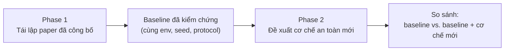

# Safe-MARL-UAV

**Học tăng cường đa tác tử an toàn (Safe Multi-Agent Reinforcement Learning) cho bầy UAV.**

Đây là repo bài tập lớn môn TKPTTT. Mục tiêu là huấn luyện một nhóm UAV cùng hoàn thành nhiệm vụ, đồng thời phải thoả các ràng buộc an toàn như không va chạm nhau, không va vào vật cản, không bay vào vùng cấm và không cạn pin.

> **Trạng thái hiện tại (2026-09-24):** mới xong giai đoạn *chọn và phân tích paper*. Code mới có phần đo metric và ghi lại thông tin mỗi lần chạy. Chưa có môi trường, thuật toán hay kết quả huấn luyện nào.

---

## 1. Bài toán

Mỗi UAV là một tác tử (agent). Agent chỉ thấy được một phần môi trường, gồm cảm biến của chính nó và các UAV lân cận, nên bài toán được mô hình hoá thành **Dec-POMDP**. Cả bầy phải hoàn thành nhiệm vụ chung và **không vi phạm ràng buộc an toàn**. Ở đây, an toàn không chỉ là một khoản phạt trong reward mà là một tiêu chí được đánh giá riêng.

Dự án chia làm hai giai đoạn:



- **Phase 1: Tái lập (reproduction).** Chọn các paper multi-UAV MARL *đã công bố* chạy trên hai nền tảng giảng viên đề xuất là **AirSim** và **PX4/Gazebo**, rồi tái lập kết quả của chúng. Phase này **không** phải đóng góp mới, mục đích là có một baseline đáng tin.
- **Phase 2: Mở rộng.** Chỉ bắt đầu khi Phase 1 đã chạy được. Ở phase này ta gắn thêm một cơ chế an toàn lên baseline, ví dụ safety shield, lớp an toàn dựa trên MPC, constraint repair, ràng buộc pin, no-fly zone hoặc ràng buộc kết nối, rồi so sánh với baseline gốc trong cùng điều kiện.

### Phát hiện quan trọng khi tìm paper

Nhóm đã tìm trên arXiv, Semantic Scholar, GitHub và web (xem [papers/CANDIDATES.md](papers/CANDIDATES.md)) và **không tìm thấy paper nào vừa dùng AirSim hoặc PX4/Gazebo, vừa là multi-UAV MARL, vừa công khai code**. Hai nền tảng này là *simulator*, không phải benchmark MARL có sẵn. Hầu hết các paper huấn luyện trong simulator 2-D tự viết, còn AirSim/PX4 chỉ được dùng cho bài toán một UAV hoặc để kiểm chứng sau khi huấn luyện.

Hệ quả là **cả hai track đều phải tự cài đặt lại (reimplement)**, không có code gốc để chạy lại.

---

## 2. Hai track tái lập

| | **Track A: AirSim** | **Track B: PX4/Gazebo** |
|---|---|---|
| Paper | Fan et al., *UAV Collision Avoidance in Unknown Scenarios with Causal Representation Disentanglement*, **Drones** 9(1):10, 2025 | Xiang et al., *Decentralized Consensus Inference-Based Hierarchical RL for Multiconstrained UAV Pursuit-Evasion Game*, **IEEE TNNLS** 36(10), 2025 |
| DOI | [10.3390/drones9010010](https://doi.org/10.3390/drones9010010) | [10.1109/TNNLS.2025.3582909](https://doi.org/10.1109/TNNLS.2025.3582909) |
| Nhiệm vụ | Mỗi UAV bay tới đích riêng và tránh vật cản lẫn UAV khác, trong cảnh chưa từng thấy | Bầy UAV giữ đội hình, bao phủ vùng mục tiêu, tránh va chạm và né một kẻ truy đuổi (bài toán CEFC) |
| Số UAV | 8 (test tới 14) | 8 (test tới 15) |
| Quan sát | Ảnh depth camera phía trước, vị trí đích, vận tốc | Hàng xóm trong bán kính 3 m, LiDAR, thông tin mục tiêu/kẻ địch, message |
| Hành động | Liên tục 3-D: `[v_x, v_z, v_yaw]` | Hai tầng: tầng thấp là gia tốc 2-D liên tục, tầng cao chọn điểm neo rời rạc 9-D |
| Thuật toán | SAC + RAE (một policy dùng chung, học độc lập) | MAPPO (CTDE) là baseline, CI-HRL là phương pháp của tác giả |
| Vai trò simulator | Huấn luyện **và** test trong AirSim | Huấn luyện trong **MPE 2-D**, PX4/Gazebo SITL **chỉ để kiểm chứng** |
| Metric chính | SSR, ISR, SPL, Extra Distance, Avg Speed | R_H, R_t, R_n, R_e, E (tầng cao); F, N, C (tầng thấp) |
| Code công khai | Không | Không |
| Mục tiêu tái lập (T1) | Baseline SAC+RAE: SSR 29.6 / ISR 87.7 trong cảnh forest | MAPPO trên bản dựng lại CEFC trong MPE |

Chi tiết đầy đủ (reward, hyperparameter, bảng kết quả gốc, các điểm chưa rõ, sai lệch dự kiến) nằm trong:

- [papers/airsim/PAPER.md](papers/airsim/PAPER.md)
- [papers/px4_gazebo/PAPER.md](papers/px4_gazebo/PAPER.md)

### Lưu ý khi đọc kết quả

- **Track A:** paper không nêu phiên bản AirSim/Unreal và không công bố scene. Scene của nhóm chắc chắn sẽ khác, nên con số tuyệt đối không so trực tiếp được. Cái so được là *thứ tự tương đối* giữa các phương pháp.
- **Track B:** dòng "MAPPO" trong Table IV của paper thực chất là **MAPPO + AT-M**, trong đó AT-M là policy tầng thấp của chính tác giả. Paper không có số liệu MAPPO chạy riêng. Vì vậy, kết quả MAPPO thuần của nhóm **không so trực tiếp** với −397.29 (xem `comparison_mode` trong [configs/px4_gazebo.yaml](configs/px4_gazebo.yaml)).
- **Cả hai paper đều không báo cáo seed hay error bar.** Kết quả của nhóm là mean ± std trên 5 seed `[0, 1, 2, 3, 4]` và luôn ghi rõ như vậy khi đặt cạnh số của paper.

### Các mức mục tiêu

Mỗi track có các mức tham vọng tăng dần. **Nếu một mức thất bại thì dừng ở đó.**

| Mức | Track A: AirSim | Track B: PX4/Gazebo |
|---|---|---|
| **T0** hạ tầng | Spawn và điều khiển 8 drone, đọc được ảnh depth | Chạy 8 PX4 SITL + Gazebo Classic trong Docker, điều khiển offboard |
| **T1** mục tiêu chính | Tái lập baseline SAC + RAE | MAPPO trên CEFC (MPE) |
| **T2** mở rộng | Thêm module CRD | Đưa policy sang PX4/Gazebo SITL |

---

## 3. Cấu trúc codebase

```
.
├── AGENT.md              # Quy tắc dự án: phạm vi Phase 1/2, ràng buộc, Definition of Done
├── README.md
├── pyproject.toml        # Dependency (quản lý bằng uv)
├── main.py               # Placeholder
│
├── papers/               # Phân tích paper. ĐỌC TRƯỚC KHI CODE
│   ├── CANDIDATES.md     #   Nhật ký tìm paper: đã chọn gì, loại gì, vì sao
│   ├── airsim/PAPER.md   #   Track A: toàn bộ thông số đã trích từ PDF
│   ├── px4_gazebo/PAPER.md  # Track B
│   └── *.pdf             #   Bản PDF gốc của hai paper
│
├── configs/              # Mọi hyperparameter, mỗi giá trị có gắn nguồn
│   ├── airsim.yaml
│   └── px4_gazebo.yaml
│
├── environments/         # Adapter cho simulator (chưa cài đặt)
│   ├── airsim/
│   └── px4_gazebo/
├── algorithms/           # SAC+RAE, MAPPO, ... (chưa cài đặt)
├── evaluate/
│   └── metrics.py        # Metric của cả hai paper, định nghĩa đúng như trong paper  ✅
└── utils/
    └── seed.py           # Đặt seed + RunRecord ghi lại thông tin mỗi lần chạy     ✅
```

Dự kiến sẽ thêm `reproduce/airsim.py`, `reproduce/px4_gazebo.py` (script chạy thí nghiệm) và `results/` (kết quả, chỉ được ghi thêm, không ghi đè).

### Quy ước quan trọng

1. **Mỗi giá trị trong config đều có tag nguồn:** `[drones]`, `[iros22]` hoặc `[tnnls]` nghĩa là lấy từ paper, còn `[ours]` là **lựa chọn của nhóm**. Mọi giá trị `[ours]` đều là một *sai lệch so với paper* và phải được ghi vào mục "Deviations We Expect" trong `PAPER.md` tương ứng. Không được sửa âm thầm một giá trị lấy từ paper.
2. **`paper_reference` trong config là số liệu gốc của paper.** Tuyệt đối không ghi đè bằng kết quả của nhóm.
3. **Không bịa kết quả, và không nói là "đã tái lập" khi chưa thực sự chạy.**
4. **Code riêng của từng simulator nằm trong adapter của nó.** Mỗi môi trường expose `reset()`, `step(actions)`, `close()`.
5. **Phase 1 không được có cơ chế an toàn của Phase 2** (shield, MPC, ...). Code Phase 2 để tách riêng.
6. **Mỗi lần chạy phải lưu `RunRecord`** ([utils/seed.py](utils/seed.py)), gồm seed, git commit, config hash, phiên bản simulator và số bước huấn luyện. File này không cho phép ghi đè.

Toàn bộ quy tắc xem trong [AGENT.md](AGENT.md).

---

## 4. Cài đặt

Yêu cầu Python 3.14 và [uv](https://docs.astral.sh/uv/).

```bash
git clone https://github.com/Grizzlazy/Safe-MARL-UAV.git
cd Safe-MARL-UAV
uv sync
```

Ví dụ dùng module có sẵn:

```python
from utils.seed import set_seed, RunRecord, run_dir
from evaluate.metrics import airsim_metrics, aggregate_seeds

set_seed(0)
# ... chạy thí nghiệm, gom kết quả ...
# metrics = airsim_metrics(episodes)
# RunRecord(track="airsim", algorithm="sac_rae", seed=0, config=cfg).save(run_dir("results", "airsim", "sac_rae", 0))
```

Simulator cần cài riêng, sẽ được bổ sung hướng dẫn ở mức T0:

- **AirSim:** bản release cuối là v1.8.1 (2022), dùng Unreal Engine 4.27. Cần GPU và môi trường desktop.
- **PX4/Gazebo:** Gazebo Classic đã deprecated và chỉ còn hỗ trợ Ubuntu 22.04, nên dự kiến chạy trong Docker.

---

## 5. Lộ trình

- [x] Tìm và chọn paper cho hai track ([CANDIDATES.md](papers/CANDIDATES.md))
- [x] Trích xuất đầy đủ thông số và bảng kết quả vào `PAPER.md`
- [x] Viết config có gắn nguồn cho từng giá trị
- [x] Cài đặt metric và công cụ ghi lại thông tin chạy
- [ ] Email tác giả xin code/scene (tuỳ chọn, chạy song song)
- [ ] **T0:** dựng hạ tầng AirSim nhiều drone và PX4 SITL 8 UAV
- [ ] **T1:** cài đặt và huấn luyện SAC+RAE (A), MAPPO trên CEFC (B)
- [ ] Chạy 5 seed, so sánh với paper, ghi lại các sai lệch
- [ ] **Phase 2:** đề xuất và đánh giá cơ chế an toàn
